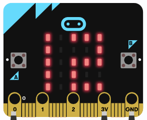

# WhaleySans Font

Modified from: makecode WhaleySans Font extension for micro:bit

The original WhaleySans Font is from [whaleygeek/mb_clock](https://github.com/whaleygeek/mb_clock).


  
  

## Add extension

Open your microbit makecode project. In Add Package, paste  

https://github.com/ykmak/pxt-whaleysans

to search box then search.


## Basic usage

https://makecode.microbit.org/_9EaTa2E4uA9i

```
let item = 0
basic.forever(function () {
    whaleysans.showNumber(item)
    item += 1
    if (item > 19) {
        item = 0
    }
})
```

## API

- **showNumber(dat: number)**  
show a (modified) WhaleySansFont number  
dat: 0-19


## License

MIT

The original WhaleySans Font: Copyright (c) 2018, microbit/micropython Chinese community  

## Supported targets

* for PXT/microbit

