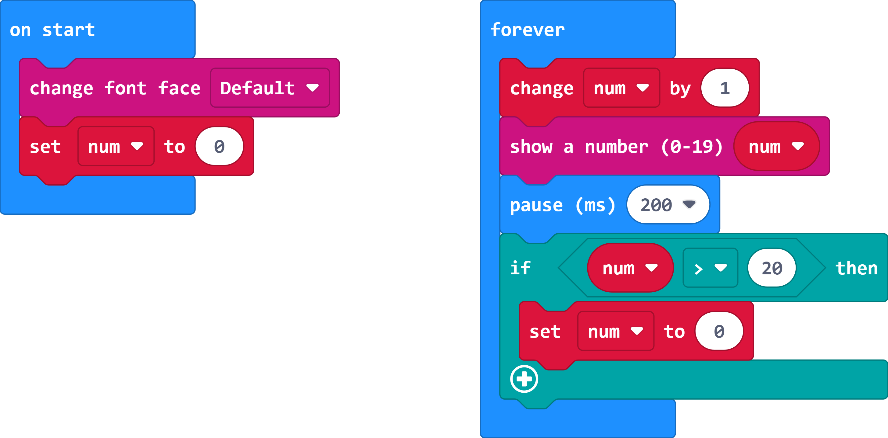

# Fonts19

Show numbers (0-19) without scroll. Modified from:

- makecode [WhaleySans Font](https://github.com/makecode-extensions/WhaleySansFont) extension for micro:bit
- makecode [Proportional Font](https://github.com/lwchkg/pxt-proportional-font) extension for micro:bit


  
  

## Add extension

Open your microbit makecode project. In Add Package, paste  

https://github.com/obzbit/pxt-fonts19

to search box then search.


## Basic usage

  

```
let num = 0
basic.forever(function () {
    num += 1
    fonts19.showNumber(num)
    basic.pause(100)
    if (num > 20) {
        num = 0
    }
})
```

## API

- **changeFont(fontFace: FontFace)**

change font face

fontFace: DEFAULT, DIGITAL, PROP

- **showNumber(dat: number)**

show a number in selected font

dat: 0-19


## License

MIT

## Supported targets

* for PXT/microbit

